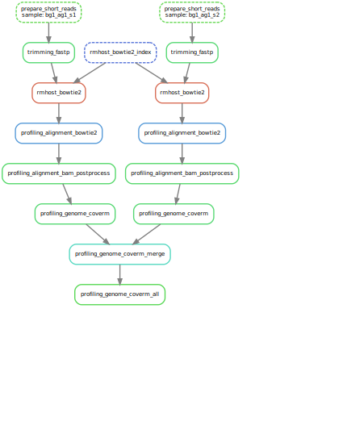

[](http://bioconda.github.io)
[](http://anaconda.org/ohmeta)
[](https://badge.fury.io/py/quantpi)
[](https://anaconda.org/bioconda/quantpi)

# Microbiome profiling pipeline

## Overview
<div align=center></div>

## Basic environment

```bash
➤ mkdir -p ~/.conda/envs
➤ wget -c https://github.com/conda-forge/miniforge/releases/latest/download/Miniforge3-Linux-x86_64.sh
➤ bash Miniforge3-Linux-x86_64.sh
# set the install path to ~/.conda/envs/quantpi-env
# init shell, then relogin
➤ conda config --add channels nodefaults
➤ conda config --add channels bioconda
➤ conda config --add channels conda-forge
➤ conda config --set channel_priority strict
➤ conda init bash # conda init zsh

# ssh relogin, then activate quantpi-env
➤ conda activate quantpi-env

# install snakemake
➤ mamba install snakemake fd-find seqkit ruamel.yaml pandas numpy natsort openpyxl biopython seaborn matplotlib executor
```

## Installation

### Latest version (**Recommended**)

```bash
➤ git clone https://github.com/ohmeta/quantpi
➤ echo "export PYTHONPATH=/path/to/quantpi:$PYTHONPATH" >> ~/.bashrc
```

### From Bioconda

```bash
➤ mamba install quantpi=1.0.0
```

### From PYPI

```bash
➤ pip install quantpi=1.0.0
```

## Help

```bash
➤ mamba activate quantpi-env

➤ quantpi --help
# or
➤ python /path/to/quantpi/run_quantpi.py --help

    ██████  ██    ██  █████  ███    ██ ████████ ██████  ██
   ██    ██ ██    ██ ██   ██ ████   ██    ██    ██   ██ ██
   ██    ██ ██    ██ ███████ ██ ██  ██    ██    ██████  ██
   ██ ▄▄ ██ ██    ██ ██   ██ ██  ██ ██    ██    ██      ██
    ██████   ██████  ██   ██ ██   ████    ██    ██      ██
       ▀▀

           Omics for All, Open Source for All

A general profiling system focus on robust microbiome research

optional arguments:
  -h, --help     show this help message and exit
  -v, --version  print software version and exit

available subcommands:

    init         init project
    simulate_wf  simulate reads
    profiling_wf metagenome-profiling pipeline
    sync         quantpi sync project
```

## Help init

```bash
➤ quantpi init --help
# or
➤ python /path/to/quantpi/run_quantpi.py init --help

usage: quantpi init [-h] [-d WORKDIR] [--check-samples] [-s SAMPLES] [-b {simulate,trimming,rmhost,profiling}] [--trimmer {oas1,sickle,fastp}] [--rmhoster {bwa,bowtie2,minimap2,kraken2,kneaddata}]

options:
  -h, --help            show this help message and exit
  -d, --workdir WORKDIR
                        project workdir (default: ./)
  --check-samples       check samples, default: False
  -s, --samples SAMPLES
                        desired input:
                        samples list, tsv format required.

                        if begin from trimming, rmhost, or assembly:
                            if it is fastq:
                                the header is: [sample_id, fq1, fq2]
                            if it is sra:
                                the header is: [sample_id, sra]

                        if begin from simulate:
                                the header is: [id, genome, abundance, reads_num, model]

  -b, --begin {simulate,trimming,rmhost,profiling}
                        pipeline starting point (default: trimming)
  --trimmer {oas1,sickle,fastp}
                        which trimmer used (default: fastp)
  --rmhoster {bwa,bowtie2,minimap2,kraken2,kneaddata}
                        which rmhoster used (default: bowtie2)

```

## Workflow list

### profiling_kraken2_all
<div align=center></div>

### profiling_bracken_all
<div align=center></div>

### profiling_kmcp_all
<div align=center></div>

### profiling_genomecov_all
<div align=center></div>

### profiling_genome_coverm_all
<div align=center></div>

### profiling_metaphlan3_all
<div align=center></div>

### profiling_humann3_all
<div align=center></div>

## Real world

### Step 1: download [LMAS](https://github.com/B-UMMI/LMAS) data

A set of simulated samples were generated from the genomes in the ZymoBIOMICS standard though the [InSilicoSeq sequence simulator](https://github.com/HadrienG/InSilicoSeq) (version 1.5.2),
including both even and logarithmic distribution, with and without Illumina error model. The number of read pairs generated matches the number of read pairs in the real data for each distribution.
The following samples are available in Zenodo:

- **ENN** - Evenly distributed sample with no error model
- **EMS** - Evenly distributed sample with Illumina MiSeq error model
- **LNN** - Log distributed sample with no error model
- **LHS** - Log distributed sample with Illumina HiSeq error model

```bash
➤ mkdir -p test
➤ mkdir -p test/fastq
➤ cd test
#  - mock even distributed data no error
➤ wget -c https://zenodo.org/record/5579145/files/ENN_1.fq.gz -P ./fastq/
➤ wget -c https://zenodo.org/record/5579145/files/ENN_2.fq.gz -P ./fastq/

#  - mock even distributed data illumina miseq error
➤ wget -c https://zenodo.org/record/5579145/files/EMS_1.fq.gz -P ./fastq/
➤ wget -c https://zenodo.org/record/5579145/files/EMS_2.fq.gz -P ./fastq/

#  - mock log distributed data no error
➤ wget -c https://zenodo.org/record/5579145/files/LNN_1.fq.gz -P ./fastq/
➤ wget -c https://zenodo.org/record/5579145/files/LNN_2.fq.gz -P ./fastq/

#  - mock log distributed data illumina hiseq error
➤ wget -c https://zenodo.org/record/5579145/files/LHS_1.fq.gz -P ./fastq/
➤ wget -c https://zenodo.org/record/5579145/files/LHS_2.fq.gz -P ./fastq/

```

### Step 2: prepare samples sheet

```bash
➤ fd -a fq.gz fastq/ | sort | uniq | paste - - | awk -F'[/_]' 'BEGIN{print "sample_id\tfq1\tfq2"};{print $(NF-1) "\t" $0}' > samples.tsv 
```

`samples.tsv` looks like below:

  |  sample_id  |            fq1            |            fq2            |
  | :---------: | :-----------------------: | :-----------------------: |
  |  ENN        | /full/path/to/ENN_1.fq.gz | /full/path/to/ENN_2.fq.gz |
  |  EMS        | /full/path/to/EMS_1.fq.gz | /full/path/to/EMS_2.fq.gz |
  |  LNN        | /full/path/to/LNN_1.fq.gz | /full/path/to/LNN_2.fq.gz |
  |  LHS        | /full/path/to/LHS_1.fq.gz | /full/path/to/LHS_2.fq.gz |

### Step 3: Init

```bash
➤ quantpi init -d . -s samples.tsv
# or
➤ python /path/to/quantpi/run_quantpi.py init -d . -s samples.tsv
```

### Step 4: workflow list

```bash
➤ quantpi profiling_wf --list
# or
➤ python /path/to/quantpi/run_quantpi.py profiling_wf --list
Running quantpi profiling_wf:
snakemake --snakefile /path/to/quantpi/quantpi/snakefiles/profiling_wf.smk --configfile ./config.yaml --cores 240 --keep-going --printshellcmds --reason --until all --list
all
prepare_long_reads_all
prepare_reads_all
prepare_short_reads
prepare_short_reads_all
profiling_alignment_bam_postprocess
profiling_alignment_bowtie2
profiling_all
profiling_bracken_all
profiling_genome_coverm_all
profiling_genomecov_all
profiling_humann2_all
profiling_humann35
profiling_humann35_all
profiling_humann35_config
profiling_humann35_join
profiling_humann35_postprocess
profiling_humann35_split_stratified
profiling_humann38
profiling_humann38_all
profiling_humann38_config
profiling_humann38_join
profiling_humann38_postprocess
profiling_humann38_split_stratified
profiling_humann39
profiling_humann39_all
profiling_humann39_config
profiling_humann39_join
profiling_humann39_postprocess
profiling_humann39_split_stratified
profiling_kmcp_all
profiling_kraken2_all
profiling_metaphlan2_all
profiling_metaphlan3
profiling_metaphlan3_all
profiling_metaphlan3_merge
profiling_metaphlan40
profiling_metaphlan40_all
profiling_metaphlan40_merge
profiling_metaphlan41
profiling_metaphlan41_all
profiling_metaphlan41_merge
profiling_strainphlan3_all
profiling_strainphlan40_all
profiling_strainphlan41_all
qcreport_all
qcreport_plot
qcreport_summary
raw_all
raw_fastqc_all
raw_report
raw_report_all
raw_report_merge
raw_report_refine
rmhost_alignment_report
rmhost_all
rmhost_bowtie2
rmhost_bowtie2_all
rmhost_bowtie2_index
rmhost_bwa_all
rmhost_kneaddata_all
rmhost_kraken2_all
rmhost_minimap2_all
rmhost_report
rmhost_report_all
rmhost_report_merge
rmhost_report_refine
trimming_all
trimming_fastp
trimming_fastp_all
trimming_fastp_multiqc
trimming_report
trimming_report_all
trimming_report_merge
trimming_report_refine
trimming_sickle_all
trimming_trimmomatic_all

Real running cmd:
snakemake --snakefile /path/to/quantpi/quantpi/snakefiles/profiling_wf.smk --configfile ./config.yaml --cores 240 --keep-going --printshellcmds --reason --until all --list
```

### Step 4: update config.yaml

```bash
➤ cat config.yaml

params:
  reads_layout: pe
  interleaved: false
  have_long: false
  fq_encoding: sanger
  begin: trimming
  samples: samples.tsv

  simulate:
    do: false
    threads: 8

  raw:
    do: true
    threads: 8
    check_paired: true
    save_reads: true

    fastqc:
      do: false

  trimming:
    save_reads: false
    threads: 8

    sickle:
      do: false
      quality_type: sanger
      sickle_pe: ''
      length_cutoff: 51
      quality_cutoff: 20

    fastp: # recommand
      do: true
      use_slide_window: false # strict when using slide window
      disable_adapter_trimming: false
      detect_adapter_for_se: true # If activated, adapter_sequence will not used
      detect_adapter_for_pe: true # If activated, adapter_sequence and adapter_sequence_r2 will not used
      adapter_sequence: AAGTCGGAGGCCAAGCGGTCTTAGGAAGACAA   # MGI adapter 3
      adapter_sequence_r2: AAGTCGGATCGTAGCCATGTCGTTCTGTGAGCCAAGGAGTTG   # MGI adapter 5
      # "AGATCGGAAGAGCACACGTCTGAACTCCAGTCA"         # eg: Illumina TruSeq adapter 3
      # "AGATCGGAAGAGCGTCGTGTAGGGAAAGAGTGT"         # eg: Illumina TruSeq adapter 5
      compression: 6
      cut_front_window_size: 4
      cut_front_mean_quality: 20
      cut_tail_window_size: 4
      cut_tail_mean_quality: 20
      cut_right_window_size: 4
      cut_right_mean_quality: 20
      length_required: 51
      n_base_limit: 5
      dedup: false
      dup_calc_accuracy: 3 # [1, 2, 3, 4, 5, 6] # only used when dedup: True

    trimmomatic:
      do: false
      phred: -phred33
      save_unpaired: false
      trimmomatic_options: MINLEN:50 ILLUMINACLIP:/path/to/adapters.fa:2:40:15 SLIDINGWINDOW:4:20   # eg: adapters: /path/to/TruSeq3-PE-2.fa


  rmhost:
    host_fasta: /lustre/store/dbs/genomics/human/CHM13/chm13v2.0_plusY/chm13v2.0.fa
    threads: 8
    save_reads: true
    save_bam: false
    compression: 6

    bwa:
      do: false
      algorithms: mem   # "mem2"
      index_prefix: /lustre/store/dbs/genomics/human/CHM13/chm13v2.0_plusY/bwa_index/chm13v2.0.fa
      minimum_seed_length: 23

    bowtie2: # recommand
      do: true
      index_prefix: /lustre/store/dbs/genomics/human/CHM13/chm13v2.0_plusY/chm13v2.0.fa
      presets: --very-sensitive

    minimap2:
      do: false
      split_size: 4G
      preset: sr
      index: /lustre/store/dbs/genomics/human/CHM13/chm13v2.0_plusY/minimap_index/chm13v2.0.fa

    kraken2:
      do: false
      database: /lustre/store/dbs/kraken/minikraken2_v2_8GB_201904_UPDATE
      host_taxid: 9606
      # must include human reference genome
      confidence: 0
      min_base_quality: 0
      min_hit_groups: 2

    kneaddata:
      do: false
      do_trf: false
      do_trimmomatic: false
      trimmomatic_options: MINLEN:50 ILLUMINACLIP:/path/to/adapters.fa:2:40:15 SLIDINGWINDOW:4:20   # eg: adapters: /path/to/TruSeq3-PE-2.fa
      sequencer_source: TruSeq3   # ["NexteraPE", "TruSeq2", "TruSeq3", "none"]
      do_bmtagger: false
      do_bowtie2: true
      decontaminate_pairs: strict   # ["strict", "lenient", "unpaired"]
      bowtie2_options: --very-sensitive --dovetail
      bowtie2_database: /lustre/store/dbs/genomics/human/CHM13/chm13v2.0_plusY/   # directory, not bowtie2 index prefix


  qcreport:
    do: true
    seqkit:
      threads: 4


  profiling:
    threads: 8

    # DNA-to-DNA
    kraken2:
      do: false
      database: /lustre/store/dbs/ecogenomics/Struo2/GTDB_release202/kraken2
      taxonomy: /lustre/store/dbs/ecogenomics/Struo2/GTDB_release202/kraken2/taxonomy
      quick: false
      memory_mapping: false
      use_names: true
      use_mpa_style: false
      report_zero_counts: false
      confidence: 0
      min_base_quality: 0
      min_hit_groups: 2
      unclassified_out: false
      classified_out: false
      save_table: false

    bracken:
      do: false
      reads_len: 100
      level: [D, P, C, O, F, G, S, S1]

    # DNA-to-DNA
    kmcp:
      do:
        bacteriome: false
        mycobiome: false
        virome: false
      database:
        bacteriome: /lustre/store/dbs/ecogenomics/KMCP/bacteriome/GTDB_r202/gtdb.kmcp
        mycobiome: /lustre/store/dbs/ecogenomics/KMCP/mycobiome/RefSeq_r208/refseq-fungi.kmcp
        virome: /lustre/store/dbs/ecogenomics/KMCP/virome/GenBank_246/genbank-viral.kmcp
        taxdump: /home/jiezhu/.taxonkit
      search:
        threads: 24
        reads_mode: Single-end   # "Paired-end" # Recommended Single-end
        min_query_len: 30
        min_query_cov: 0.55
        external_opts: ''
      profile:
        threads: 4 # recommand
        mode: [0, 1, 2, 3, 4, 5]
        level: strain   # ["species", "strain", "assembly"]
        # reference: https://bioinf.shenwei.me/kmcp/tutorial/profiling/
        # kmcp profile mode details
        # 0: for pathogen detection
        # 1: higher recall
        # 2: high recall
        # 3: default
        # 4: high precision
        # 5: higher precision
        # options                       m=0    m=1   m=2   m=3    m=4   m=5
        # ---------------------------   ----   ---   ---   ----   ---   ----
        # -r/--min-chunks-reads         1      5     10    50     100   100
        # -p/--min-chunks-fraction      0.2    0.6   0.7   0.8    1     1
        # -d/--max-chunks-depth-stdev   10     2     2     2      2     1.5
        # -u/--min-uniq-reads           1      2     5     20     50    50
        # -U/--min-hic-ureads           1      1     2     5      10    10
        # -H/--min-hic-ureads-qcov      0.55   0.7   0.7   0.75   0.8   0.8
        # -P/--min-hic-ureads-prop      0.01   0.1   0.2   0.1    0.1   0.15
        # --keep-main-matches           true
        # --max-qcov-gap                0.4
        # If you want to overide some parameter setted by preset mode, just add it to external_opts below.
        metaphlan_report_version: 3
        disable_two_stage_taxonomy_assignment: true # --no-amb-corr
        external_opts: ''

    # DNA-to-marker
    metaphlan:
      do_v2: False   # metaphlan2
      do_v3: False   # metaphlan3
      do_v40: True   # metaphlan v4.0.*
      do_v41: True   # metaphlan v4.1.*
      bowtie2db_v2: "/lustre/store/dbs/ecogenomics/MetaPhlAn/mpa_v20/bowtie2_index"
      bowtie2db_v3: "/lustre/store/dbs/ecogenomics/MetaPhlAn/mpa_v30/bowtie2_index"
      bowtie2db_v40: "/lustre/store/dbs/ecogenomics/MetaPhlAn/mpa_vOct22/bowtie2_index"
      bowtie2db_v41: "/lustre/store/dbs/ecogenomics/MetaPhlAn/mpa_vJun23/bowtie2_index"
      index_prefix_v2: "v20_m200"
      index_prefix_v3: "mpa_v30_CHOCOPhlAn_201901"
      index_prefix_v40: "mpa_vOct22_CHOCOPhlAnSGB_202212"
      index_prefix_v41: "mpa_vJun23_CHOCOPhlAnSGB_202403"
      bowtie2_presets: "very-sensitive"
      taxonomic_level: "a"
      min_cu_len: 2000
      read_min_len: 70
      analysis_type: "rel_ab_w_read_stats" #[ "rel_ab", "rel_ab_w_read_stats", "reads_map", "clade_profiles", "marker_ab_table", "marker_counts", "marker_pres_table" ]
      stat: "tavg_g"
      external_opts_v2: ""
      external_opts_v3: "--unknown_estimation"
      external_opts_v40: "--unclassified_estimation"
      external_opts_v41: "--unclassified_estimation"

    strainphlan:
      do_v3: False                                                # metaphlan3
      do_v40: False                                               # metaphlan4
      do_v41: False                                               # metaphlan4
      reference_genome:
        use: False
        clades_tsv_v3: "/path/to/clades_v3.tsv"                   # extrct clade markes from specific clades, two column, [clade\tfna_path]
        clades_tsv_v40: "/path/to/clades_v40.tsv"                 # extrct clade markes from specific clades, two column, [clade\tfna_path]
        clades_tsv_v41: "/path/to/clades_v41.tsv"                 # extrct clade markes from specific clades, two column, [clade\tfna_path]
      marker_in_n_samples: "1"                                    # reduce it if meet: Phylogeny can not be inferred. Too many markers were discarded
      sample_with_n_markers: "10"
      phylophlan_mode: "accurate"
      breadth_thres: "80"
      external_opts_v3: ""
      external_opts_v40: ""
      external_opts_v41: ""


    # Functional profiling
    humann:
      do_v2: False   # reply on metaphlan2 v2*
      do_v35: False  # reply on metaphlan  v3*
      do_v38: True   # reply on metaphlan  v4.0.*
      do_v39: True   # reply on metaphlan  v4.1.*
      # humann v3.5, v3.6, v3.7, v3.8, v3.9 used same database v31
      database_nucleotide_v2: "/lustre/store/dbs/funcgenomics/HUMAnN/v2/chocophlan"
      database_nucleotide_v31: "/lustre/store/dbs/funcgenomics/HUMAnN/v3.1/chocophlan"
      database_protein_v2: "/lustre/store/dbs/funcgenomics/HUMAnN/v2/uniref"
      database_protein_v31: "/lustre/store/dbs/funcgenomics/HUMAnN/v3.1/uniref"
      database_utility_mapping_v2: "/lustre/store/dbs/funcgenomics/HUMAnN/v2/utility_mapping"
      database_utility_mapping_v31: "/lustre/store/dbs/funcgenomics/HUMAnN/v3.1/utility_mapping"
      prescreen_threshold: 0.005 # minimum percentage of reads matching a species, default: 0.01
      identity_threshold: 50.0
      nucleotide_identity_threshold: 0.0 # nucleotide: 0
      translated_identity_threshold: 80.0 # uniref90: 80.0; uniref50: 50.0
      nucleotide_subject_coverage_threshold: 50.0
      translated_subject_coverage_threshold: 50.0
      nucleotide_query_coverage_threshold: 90.0
      translated_query_coverage_threshold: 90.0
      translated-alignment: "diamond" # ["diamond", "usearch", "rapsearch"]
      pathways: "metacyc" # ["metacyc", "unipathway"]
      normalize_method: "relab"
      regroup_method: "sum"
      map_database: ["uniref90_go", "uniref90_ko", "uniref90_eggnog", "uniref90_pfam"] # ["uniref90_level4ec", "uniref90_infogo1000", "uniref90_rxn" ]
      external_opts_v2: ""
      external_opts_v35: ""
      external_opts_v38: ""
      external_opts_v39: ""


    # alignment method
    genomecov:
      do: false
      bowtie2_db_prefix: /lustre/store/dbs/ecogenomics/virome/virome.fasta
      bowtie2_db_fasta: /lustre/store/dbs/ecogenomics/virome/virome.fasta
      gen_contig_cov_script: /home/jiezhu/toolkit/metassemble/scripts/validate/map/gen_contig_cov_per_bam_table.py

    # alignment method
    coverm:
      do: false
      genome_dir: /lustre/store/dbs/ecogenomics/virome/genomes
      genome_fasta_extension: fna
      methods: [relative_abundance, mean, trimmed_mean, covered_fraction, covered_bases,
        variance, rpkm, tpm]
      min_covered_fraction: 10
      contig_end_exclusion: 75
      trim_min: 5
      trim_max: 95

    # custom method
    bgi_soap: # for learning and test
      do: false
      taxonomy: /path/to/mag_taxonomy
      index_prefix: /path/to/mag_soap_index
      minimal_insert_size: 0
      maximal_insert_size: 1000
      report_repeat_hits: 1
      match_model: 4
      align_seed: 30
      max_mismatch_num: 5
      identity: 0.95

    bowtie2: # for learning and test
      do: false
      taxonomy: /path/to/mag_taxonomy
      index_prefix: /path/to/mag_bowtie2_index

    jgi: # for learning and test
      do: false
      metadata: /path/to/mag_metadata
      taxonomy: /path/to/mag_taxonomy
      index_prefix: /path/to/mag_bowtie2_index
      fragment: 1200
      memory_limit: 8G
      compression_level: 6

output:
  simulate: results/00.simulate
  raw: results/00.raw
  trimming: results/01.trimming
  rmhost: results/02.rmhost
  qcreport: results/03.qcreport
  profiling: results/04.profiling

envs:
  simulate: /home/jiezhu/toolkit/quantpi/test/test_dev/envs/simulate.yaml
  prepare: /home/jiezhu/toolkit/quantpi/test/test_dev/envs/prepare.yaml
  fastqc: /home/jiezhu/toolkit/quantpi/test/test_dev/envs/fastqc.yaml
  trimming: /home/jiezhu/toolkit/quantpi/test/test_dev/envs/trimming.yaml
  multiqc: /home/jiezhu/toolkit/quantpi/test/test_dev/envs/multiqc.yaml
  report: /home/jiezhu/toolkit/quantpi/test/test_dev/envs/report.yaml
  align: /home/jiezhu/toolkit/quantpi/test/test_dev/envs/align.yaml
  kraken2: /home/jiezhu/toolkit/quantpi/test/test_dev/envs/kraken2.yaml
  kneaddata: /home/jiezhu/toolkit/quantpi/test/test_dev/envs/kneaddata.yaml
  kmcp: /home/jiezhu/toolkit/quantpi/test/test_dev/envs/kmcp.yaml
  biobakery2: /home/jiezhu/toolkit/quantpi/test/test_dev/envs/biobakery2.yaml
  biobakery3: /home/jiezhu/toolkit/quantpi/test/test_dev/envs/biobakery3.yaml
  biobakery40: /home/jiezhu/toolkit/quantpi/test/test_dev/envs/biobakery40.yaml
  biobakery41: /home/jiezhu/toolkit/quantpi/test/test_dev/envs/biobakery41.yaml
```

### Step 5: Dry run profiling_wf

```bash
➤ quantpi profiling_wf all --dry-run
# or
➤ python /path/to/quantpi/run_quantpi.py profiling_wf all --dry-run


Real running cmd:
snakemake --snakefile /home/jiezhu/toolkit/quantpi/quantpi/snakefiles/profiling_wf.smk --configfile ./config.yaml --cores 240 --keep-going --printshellcmds --reason --until all --dry-run

Job stats:
job                                   count    min threads    max threads
----------------------------------  -------  -------------  -------------
all                                       1              1              1
prepare_short_reads                       4              8              8
profiling_humann39                        4              8              8
profiling_humann39_config                 1              1              1
profiling_humann39_join                   1              1              1
profiling_humann39_postprocess            4              1              1
profiling_humann39_split_stratified       1              1              1
profiling_metaphlan41                     4              8              8
profiling_metaphlan41_merge               1              8              8
qcreport_plot                             1              1              1
qcreport_summary                          1              4              4
raw_report                                4              4              4
raw_report_merge                          1              4              4
raw_report_refine                         4              1              1
rmhost_bowtie2                            4              8              8
rmhost_report                             4              4              4
rmhost_report_merge                       1              4              4
rmhost_report_refine                      4              1              1
trimming_fastp                            4              8              8
trimming_fastp_multiqc                    1              1              1
trimming_report                           4              4              4
trimming_report_merge                     1              4              4
trimming_report_refine                    4              1              1

```

### Step 6: Wet run profiling_wf

```bash
➤ quantpi profiling_wf all --use-conda --cores 80 --jobs 10 --run-local
# or
➤ python /path/to/quantpi/run_quantpi.py profiling_wf all --use-conda --cores 80 --jobs 10 --run-local
```

### Step 7: check and understand results (WIP)

```bash
➤ tree results
```
